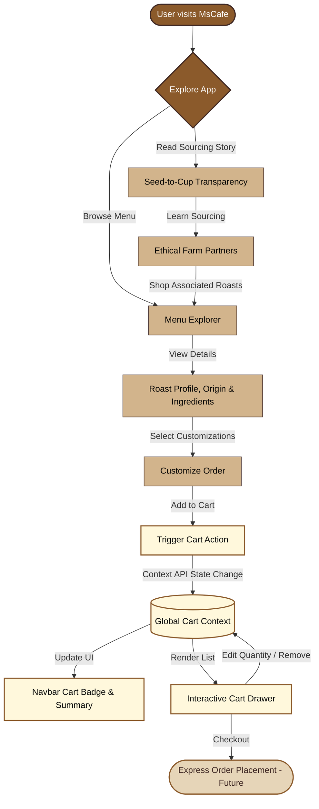

# ☕ MsCafe — Premium Coffee Shop Web Application

<p align="center">
  
  
  
  
  
</p>

---

## 🌟 About MsCafe

**MsCafe** was founded with a simple, yet passionate mission: **to serve the ultimate coffee experience**. Our journey begins with ethically sourcing premium coffee beans from sustainable, independent farms around the globe and ends with expert brewing techniques that unlock rich, complex flavors in every single cup.

This web application brings the premium physical experience of MsCafe to the digital world. Crafted with a modern user experience in mind, it allows coffee lovers to explore our curated menu, understand the origin and roast profiles of our beans, and interactively customize their virtual orders.

---

## 🚀 Key Features

*   ✨ **Elegant Menu Explorer:** Browse through rich selections of espresso drinks, cold brews, pour-overs, and custom blends with detailed ingredient lists and notes.
*   🌱 **Seed-to-Cup Transparency:** A dedicated space highlighting our partners, sustainable farming practices, and ethical supply chain.
*   🎨 **Sleek, Modern UI:** A fully responsive, modern layout optimized for desktops, tablets, and mobile devices, using fluid Tailwind utility classes and rich color schemes.
*   🛒 **Interactive Cart System:** Seamless state-managed cart using React Context API, allowing users to add, customize, and review their selections.
*   🐳 **Production-Ready Docker Setup:** Pre-configured Docker environment optimized with multi-stage builds and a lightweight Nginx web server.

---

## 📊 Application Flow

Here is the flow of user interaction and state management within the MsCafe application:



---


## 🛠️ Architecture & Tech Stack

### Frontend Core
- **React.js:** Component-driven user interface architecture.
- **React Context API:** Centralized state management for the shopping cart, active views, and interactive themes.

### Styling & Design
- **Tailwind CSS:** Responsive grid system, custom typography, utility styling, and sleek hover effects.
- **Headless UI & Heroicons:** Fully accessible UI components and modern vector icons.

### Deployment & DevOps
- **Docker:** Multi-stage builds to minimize image sizes (under 30MB).
- **Nginx:** High-performance, lightweight web server configured for client-side routing.

---

## 📦 Getting Started & Installation

Follow these steps to set up a local development copy of MsCafe.

### Prerequisites

Ensure you have the following installed on your machine:
*   [Node.js](https://nodejs.org/) (v18.0.0 or higher recommended)
*   [npm](https://www.npmjs.com/) (v9.0.0 or higher) or Yarn
*   [Docker](https://www.docker.com/) (Optional, for containerized environments)

### 1. Local Installation

```bash
# Clone the repository
git clone https://github.com/Umangpandey75/Coffee_Shop_main.git

# Navigate into the project root directory
cd Coffee_Shop_main

# Install all development and application dependencies
npm install
```

### 2. Running the Development Server

Start the interactive development server:

```bash
npm start
```

*   The application will automatically launch in your browser.
*   If it does not, visit: [http://localhost:3000](http://localhost:3000)
*   The page will reload automatically whenever you modify any file in the workspace.

---

## 🐳 Docker Deployment

For staging or production deployments, use the provided multi-stage Docker environment.

### Build the Image
To build the optimized production image:
```bash
docker build -t mscafe-app:latest .
```

### Run the Container
Run the container on port `80` (or map it to any port you prefer):
```bash
docker run -d -p 80:80 --name mscafe-container mscafe-app:latest
```
Open [http://localhost](http://localhost) in your browser to view the application served by Nginx.

---

## 📁 File Structure

Here is a breakdown of the key files in the repository:

```
Coffee_Shop_main/
├── public/                 # Static assets, site icons, and index.html
├── src/                    # Source code files
│   ├── components/         # Reusable UI components (Navbar, Footer, Menu Card, etc.)
│   ├── contexts/           # React Context files (CartContext, ThemeContext)
│   ├── data/               # Static menu items, farmers list, and mock data
│   ├── App.js              # Core entry component
│   └── index.js            # React DOM mounting and global styling
├── Dockerfile              # Multi-stage Docker build configuration
├── nginx.conf              # Nginx custom server configuration for React routing
├── tailwind.config.js      # Custom theme colors, spacing, and Tailwind rules
├── postcss.config.js       # PostCSS plugins configuration
└── package.json            # Application dependencies and lifecycle scripts
```

---

## ⚙️ Configuration Files Explained

- **`Dockerfile`:** Uses a two-stage approach. First, `node:18` builds the static production bundle (`npm run build`). In the second stage, a lightweight `nginx:stable-alpine` image copies the built files to the Nginx web root and runs the server, ensuring tiny images and high performance.
- **`nginx.conf`:** Custom routing config ensuring that all SPA paths are redirected to `index.html` (resolving React router refresh issues).
- **`tailwind.config.js`:** Extends the default Tailwind theme to include brand-specific warm colors, custom coffee-toned palettes, and font families.

---

## 👨‍💻 Author

<div align="center">

### **Umang Pandey**
*B.Tech CSE — NITRA Technical Campus, Ghaziabad*
*Python Developer · Data Analyst · ML Engineer*

[](mailto:umangpandey.co@gmail.com)
&nbsp;
[](https://linkedin.com/in/umang-pandey-01b486273)
&nbsp;
[](https://github.com/Umangpandey75)
&nbsp;
[](https://umangpandey.vercel.app)

*"Query the data. Build the insight. Ship the WOW. ✨"*

</div>

---
## 📄 License

Distributed under the MIT License. See [LICENSE](LICENSE) for more information..
